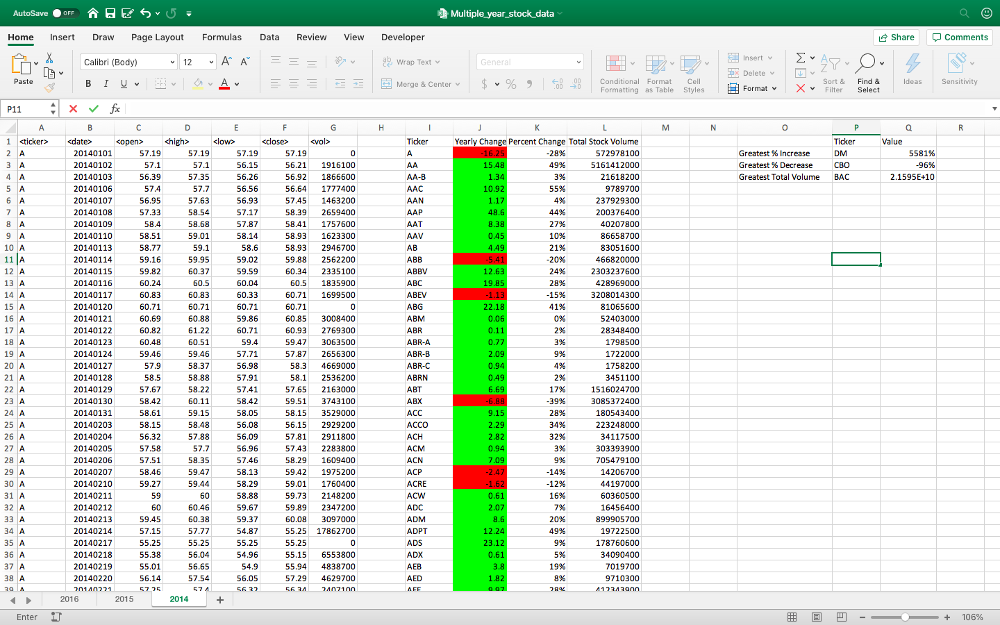
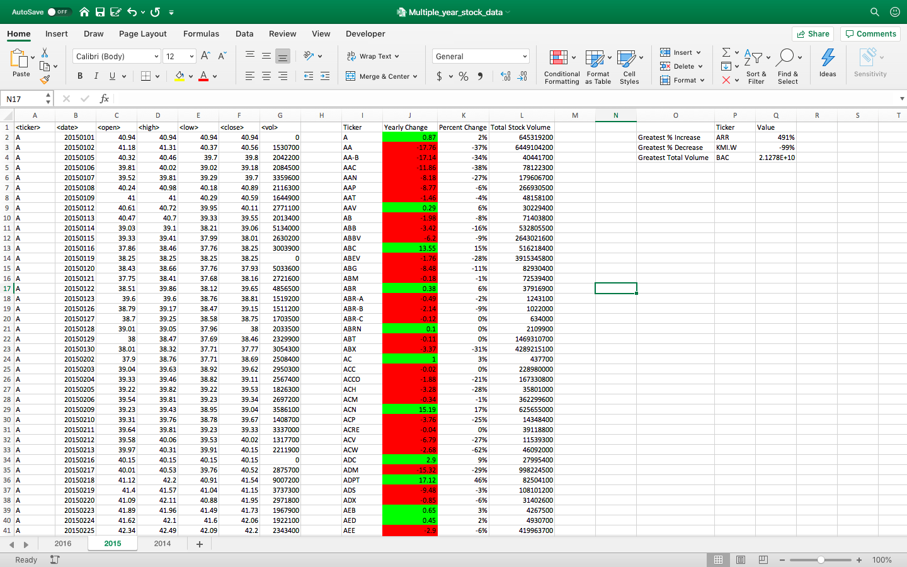
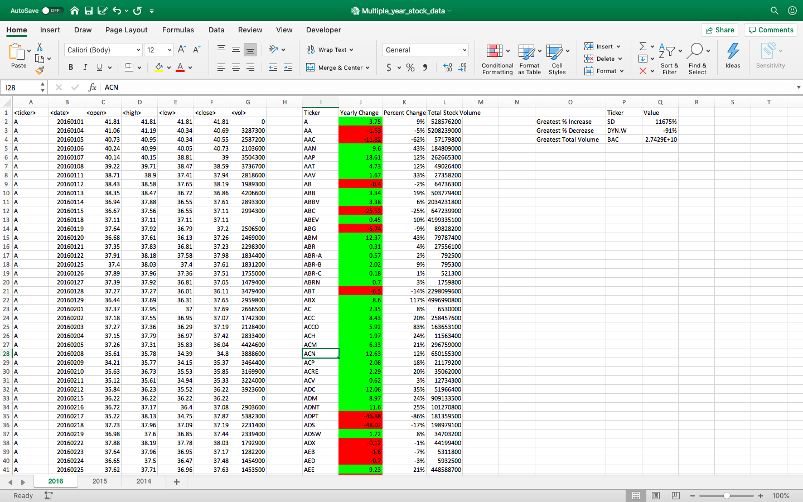

# VBA Homework - The VBA of Wall Street

In this homework assignment, I used VBA scripting to analyze real stock market data.

## Datasets
Two datasets were given:
* [Test Data](Resources/alphabetical_testing.xlsx) - This is used for developing VBA scripts.
* [Stock Data](Resources/Multiple_year_stock_data.xlsx) - This data is categorized by year 2014, 2015, and 2016. The final analysis is executed on this stock data.

## Data Analysis
The summary table contains the following columns
 * The ticker symbol.
 * Yearly change from opening price at the beginning of a given year to the closing price at the end of that year.
 * The percent change from opening price at the beginning of a given year to the closing price at the end of that year.
* The total stock volume of the stock.
The table also shows the positive change in green and negative change in red using the conditional formatting.

## Results

